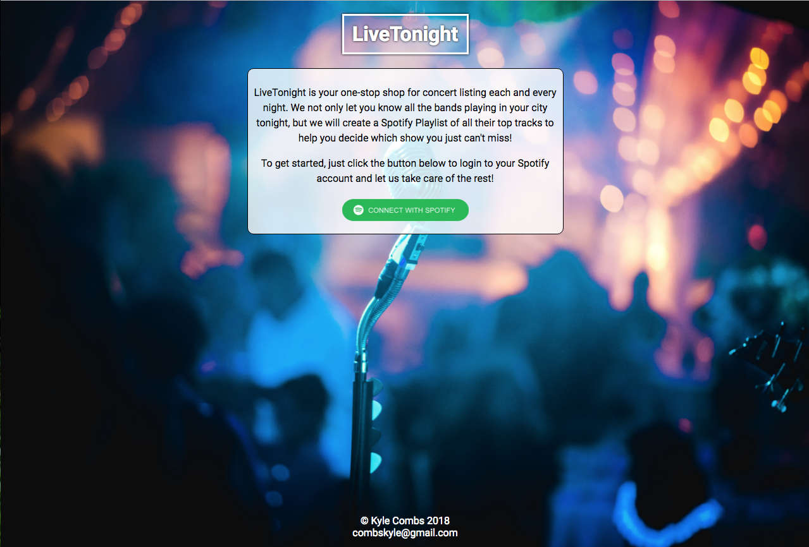
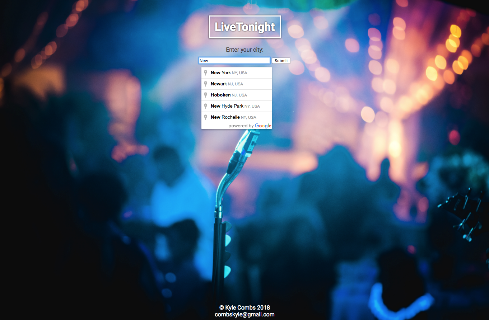
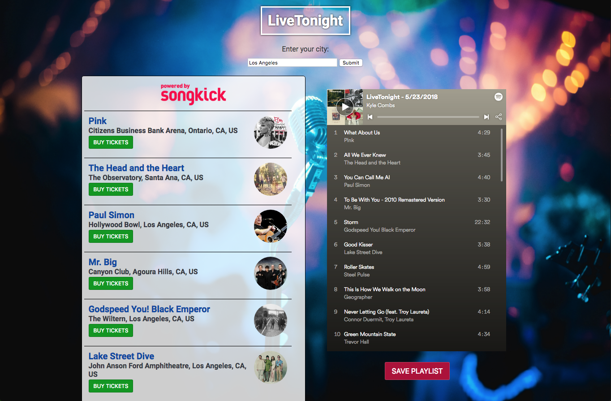

# LiveTonight
LiveTonight lets you know all the bands you can see in your city tonight and creates a Spotify Playlist of each artist's top tracks on spotify so you can give them a listen and decide who you want to go and see!

Check out the live version at [http://www.livetonight.io](http://www.livetonight.io).

## Motivation

I go see live music as often as possible and love discovering new bands live.  I wanted a way to be able to create a playlist of everything I could go see on a given night to put on in the background while I work so I can filter through and see who I would most want to go and see.

## Screenshots
Login Screen/Landing Page:

Google Places API Auto-Complete:

Concert Listings and Playlist:

## API's Used
* GoogleMaps Places API
* SongKick API
* Spotify API

## Features

* Get a listing of all concerts for tonight in any city (US and Canada Only)
* Creates a playlist of the top track by each artist on Spotify
* Allows you to save the playlist to your Spotify account to listen to away from your computer 

## Demo

- [Live Demo](http://www.texpatnyc.com/LiveTonight)

